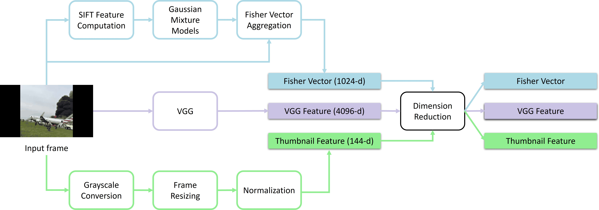
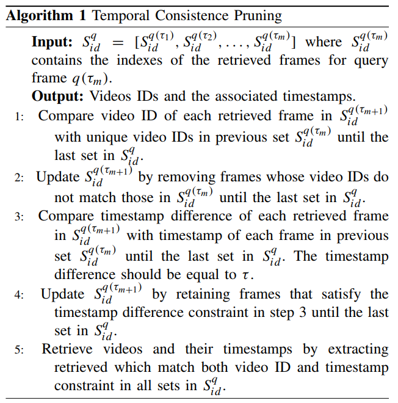
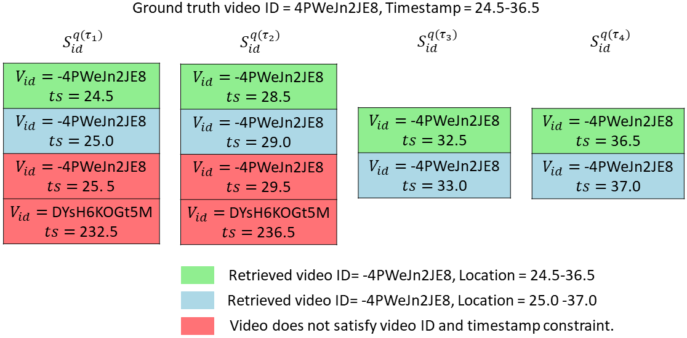

# Fast Video Deduplication and Localization With Temporal Consistence Re-Ranking
This is the official implementation of our IEEE TCVST 2024 paper titled [Fast Video Deduplication and Localization With Temporal Consistence Re-Ranking](https://ieeexplore.ieee.org/document/10577179/).

<div align="center">
  
</div>

## Prerequisites
The code is tested on Linux with the following prerequisites:
1. Python 3.12
2. PyTorch 1.11.0 (CUDA 11.3)
3. MATLAB R2021a
4. VLFeat 0.9.21

Remaining libraries are available in [requirements.txt](https://github.com/engrchrishenry/loc_aware_video_dedup/blob/main/requirements.txt)

## Installation

- Clone this repository
   ```bash
   git clone https://github.com/engrchrishenry/loc_aware_video_dedup.git
   cd loc_aware_video_dedup
   ```

- Create conda environment
   ```bash
   conda create --name dedup python=3.12
   conda activate dedup
   ```

- Install dependencies
  1. Install [PyTorch](https://pytorch.org/get-started/locally/).
  2. Install [FFmpeg](www.ffmpeg.org/download.html).
  3. The remaining packages can be installed via:
     ```bash
     pip install -r requirements.txt
     ```
  4. For running MATLAB scripts, you are required to install [VLFeat](https://www.vlfeat.org/download.html).
 
## Dataset Preparation

<!-- ### Option 1: Use Pre-computed Data -->

<!--Download -->

<!--### Option 2: Prepare dataset from scratch -->

### Download Dataset
- FIVR-200K Dataset ([Download Here](https://github.com/MKLab-ITI/FIVR-200K/tree/master))

   The paper uses videos categorized as "Duplicate Scene Videos (DSVs)". The datasets contains a total of 7,558 DSVs labelled as 'ND' in [annotations.json](https://github.com/MKLab-ITI/FIVR-200K/blob/master/dataset/annotation.json). We provide [youtube_ids_ND.txt](https://github.com/engrchrishenry/loc_aware_video_dedup/blob/main/data/youtube_ids_ND.txt) which contains IDs of all DSVs. Only 4,960 DSVs were available for download at the time of writing our paper. The list of 4,960 videos used in our experiments is provided in [FIVR_available_videos.txt](https://github.com/engrchrishenry/loc_aware_video_dedup/blob/main/data/FIVR_available_videos.txt).

- VCSL Dataset ([Download Here](https://github.com/alipay/VCSL/tree/main))
  
  We used the urls in [videos_url_uuid.csv](https://github.com/alipay/VCSL/blob/main/data/videos_url_uuid.csv) to download the dataset. Only 6,649 videos were available for download at the time of writing our paper. The uuids for the 6,649 videos used in our experiments are provided in [VCSL_available_videos.txt](https://github.com/engrchrishenry/loc_aware_video_dedup/blob/main/data/VCSL_available_videos.txt).

  > Note: Most video links might be unavailable for download. Contacting the FIVR-200K dataset and VCSL authors may help.

### Extract frames.
- FIVR-200K Dataset
  ```bash
  python extract_frames.py --data_path <path_to_fivr_videos> --frame_interval 0.5
  ```
  
  - `<path_to_fivr_videos>` must contain one subfolder per query ID.
  - All videos corresponding to the same query ID must be placed inside the same subfolder.

- VCSL Dataset
  ```bash
  python extract_frames.py --data_path <path_to_vcsl_videos> --frame_interval 0.5
  ```
 
  - `<path_to_vcsl_videos>` must contain a subfolder with any name. The subfolder must contain all the downloaded videos.

### Generate test data
- Select test videos

  Run the following to select test videos based on criteria mentioned in our paper. Test data used for experiments in our paper can be found in [test_data_list_FIVR.txt](https://github.com/engrchrishenry/loc_aware_video_dedup/blob/main/data/test_data_list_FIVR.txt) and [test_data_list_VCSL.txt](https://github.com/engrchrishenry/loc_aware_video_dedup/blob/main/data/test_data_list_VCSL.txt)
  ```bash
  python select_test_videos.py --data_path <path_to_frames> --save_file <output_path_with_filename>
  ```

    > Note: [select_test_videos.py](https://github.com/engrchrishenry/loc_aware_video_dedup/blob/main/select_test_video) requires the frames to be extracted via [extract_frames.py](https://github.com/engrchrishenry/loc_aware_video_dedup/blob/main/extract_frames.py)

- Generate normal version (as mentioned in our paper)
  ```bash
  python gen_test_data_normal.py --test_vid_list <test_data_list_path> --frames_path <path_to_frames> --out_path <output_path>
  ```
- Generate hard version (as mentioned in our paper)
  ```bash
  python gen_test_data_hard.py --test_vid_list <test_data_list_path> --frames_path <path_to_frames> --out_path <output_path>
  ```

## Feature Generation
<div align="center">
  
</div>

- ### Thumbnail Feature
  Generate thumbnail features
  ```bash
  python gen_thumb_ft.py --data_path <path_to_frames> --out_path <path_to_thumbnail_features> --global_mean <global_mean_value> --thumb_size 12
  ```
  `<global_mean_value>` required for [gen_thumb_ft.py](https://github.com/engrchrishenry/loc_aware_video_dedup/blob/main/gen_thumb_ft.py) can be calculated via:
  ```bash
  python get_global_mean.py --data_path <path_to_frames> --thumb_size 12
  ```
  In our paper, we used `<global_mean_value>` values of 0.386 and 0.329 for the FIVR-200K and VCSL datasets, respectively. You may use these values if your dataset contains the same videos listed in [FIVR_available_videos.txt](https://github.com/engrchrishenry/loc_aware_video_dedup/blob/main/data/FIVR_available_videos.txt) and [VCSL_available_videos.txt](https://github.com/engrchrishenry/loc_aware_video_dedup/blob/main/data/VCSL_available_videos.txt).
  
  Generate a single thumbnail feature file (.h5)
  ```bash
  python make_hdf5.py --feature_path <thumbnail_features_path> --save_file <output_path_with_filename>
  ```

- ### VGG Feature
  Generate VGG features
  ```bash
  python gen_vgg_ft.py --data_path <path_to_frames> --out_path <path_to_vgg_features> --batch_size 256
  ```
  Generate a single VGG feature file (.h5)
  ```bash
  python make_hdf5.py --feature_path <VGG_features_path> --save_file <output_path_with_filename>
  ```

- ### Fisher Vector Feature

  Generate fisher vector features [MATLAB Script].
  - Download the trained GMM model [trained_GMM_model.mat](https://mailmissouri-my.sharepoint.com/:u:/g/personal/chffn_umsystem_edu/IQBzyZ_xdtdrSZqW3noZWlj7AQBpr8ZCxQ1SWm-PCCfGLgI?e=66hrQc).
  - Modify VLFeat, trained GMM model, img_path, save_folder paths in [gen_fv_ft.m](https://github.com/engrchrishenry/loc_aware_video_dedup/blob/main/fisher_vector_generation/gen_fv_ft.m) from [fisher_vector_generation](https://github.com/engrchrishenry/loc_aware_video_dedup/tree/main/fisher_vector_generation) folder.
  - Run [gen_fv_ft.m](https://github.com/engrchrishenry/loc_aware_video_dedup/blob/main/fisher_vector_generation/extract_fv_sift_direct.m) in MATLAB.

  Generate a single fisher vector feature file (.h5)
  ```bash
  python make_hdf5.py --feature_path <fisher_vector_features_path> --save_file <output_path_with_filename>
  ```

## Build repository (k-d Trees)

- ### Build repository

  Generate indexes file (.pickle)
  ```bash
  python gen_index_file.py --frames_path <path_to_frames> --save_file <.pickle_file_path> --frame_interval 0.5
  ```
  Generate k-d Trees
  ```bash
  python build_repo.py \
    --thumb_file <thumbs_h5_file_path> \
    --fv_file <fv_h5_file_path> \
    --vgg_file <vgg_h5_file_path> \
    --index_file <index_file_path> \
    --out_path <output_path> \
    --pca_train_samp <number_of_train_samples_for_pca> \
    --comps <thumb_pca_components fv_pca_components vgg_pca_components>
  ```
  
  - `--thumb_file`, `--fv_file`, and `--vgg_file` are the paths to the .h5 files generated via [make_hdf5.py](https://github.com/engrchrishenry/loc_aware_video_dedup/blob/main/make_hdf5.py).
  - `--index_file` is the .pickle file generated via [gen_index_file.py](https://github.com/engrchrishenry/loc_aware_video_dedup/blob/main/gen_index_file.py).
  - `<number_of_train_samples_for_pca>` value of 150000 and 200000 was used for FIVR-200K dataset and VCSL dataset, respectively, in our experiments.

- ### Build test repository

  Generate text indexes file (.pickle)
  ```bash
  python gen_index_file.py --frames_path <path_to_test_frames> --save_file <.pickle_file_path> --frame_interval 0.5
  ```
  
  Generate k-d Trees
  ```bash
  python build_test_repo.py \
    --thumb_file <thumbs_test_h5_file_path> \
    --fv_file <fv_test_h5_file_path> \
    --vgg_file <vgg_test_h5_file_path> \
    --index_file <index_test_file_path> \
    --out_path <output_test_path> \
    --pca_model <pca_model_path> \
    --comps <thumb_pca_components fv_pca_components vgg_pca_components>
  ```
  
  - `--thumb_file`, `--fv_file`, and `--vgg_file` are the paths to the .h5 files generated via [make_hdf5.py](https://github.com/engrchrishenry/loc_aware_video_dedup/blob/main/make_hdf5.py).
  - `--index_file` is the .pickle file generated via [gen_index_file.py](https://github.com/engrchrishenry/loc_aware_video_dedup/blob/main/gen_index_file.py).
  - `--pca_model` is the path to the trained PCA model generated after running [build_repo.py](https://github.com/engrchrishenry/loc_aware_video_dedup/blob/main/build_repo.py).
  
## Video Retrieval with Localization

<p align="center">
  <table border="0" cellspacing="0" cellpadding="0">
    <tr>
      <td border="0">
        
      </td>
      <td width="50" border="0"></td>
      <td border="0">
        
      </td>
    </tr>
  </table>
</p>


<div align="center">
  
</div>

- Modify the parameters in [config_video_retrieval.yaml](https://github.com/engrchrishenry/loc_aware_video_dedup/blob/main/configs/config_video_retrieval.yaml). Read the comments in the [config_video_retrieval.yaml](https://github.com/engrchrishenry/loc_aware_video_dedup/blob/main/configs/config_video_retrieval.yaml) for guidance on modifying the parameters.  
- Run [video_retrieval.py](https://github.com/engrchrishenry/loc_aware_video_dedup/blob/main/video_retrieval.py) as follows:
  
  ```bash
  python video_retrieval.py --config <config_file_path>
  ```
  [video_retrieval.py](https://github.com/engrchrishenry/loc_aware_video_dedup/blob/main/video_retrieval.py) can produce results for varying k values. It outputs results in .txt files in `--out_path`.
<!--
## Efficient Frame Retrieval via Multiple k-d Tree Setup
The script [frame_retrieval.py](https://github.com/engrchrishenry/loc_aware_video_dedup/blob/main/frame_retrieval.py) does the following:
- Uses the single feature files generated via [gen_single_feature_file.py](https://github.com/engrchrishenry/loc_aware_video_dedup/blob/main/gen_single_feature_file.py) as input.
- Trains a PCA model for each feature to reduce the feature dimension.
- Projects the features to low-dimensional vectors using the trained PCA model.
- Builds k-d trees via the projected features.
- Query the k-d trees for frame retrieval.
- Calculates the recall and average time consumption per query frame.

To run this step:
- Modify the parameters in [config_frame_retrieval.yaml](https://github.com/engrchrishenry/loc_aware_video_dedup/blob/main/configs/config_frame_retrieval.yaml).
- Run [frame_retrieval.py](https://github.com/engrchrishenry/loc_aware_video_dedup/blob/main/frame_retrieval.py).
  
  ```bash
  python frame_retrieval.py --config <config_file_path>
  ```
-->

## Citation

If you use this work, please cite:

```bibtex
@ARTICLE{10577179,
  author={Henry, Chris and Song, Li and Li, Zhu},
  journal={IEEE Transactions on Circuits and Systems for Video Technology}, 
  title={Fast Video Deduplication and Localization With Temporal Consistence Re-Ranking}, 
  year={2024},
  volume={34},
  number={11},
  pages={12006-12018},
  keywords={Vectors;Feature extraction;Task analysis;Principal component analysis;Web sites;Video on demand;Computational modeling;Video deduplication;video retrieval;near-duplicate video retrieval;video copy detection;fisher vector},
  doi={10.1109/TCSVT.2024.3420422}}
```

You may also explore our other work on video deduplication [here](ieeexplore.ieee.org/document/10095417/). Consider citing the following:

```bibtex
@INPROCEEDINGS{10095417,
  author={Henry, Chris and Liao, Rijun and Lin, Ruiyuan and Zhang, Zhebin and Sun, Hongyu and Li, Zhu},
  booktitle={ICASSP 2023 - 2023 IEEE International Conference on Acoustics, Speech and Signal Processing (ICASSP)}, 
  title={Lightweight Fisher Vector Transfer Learning for Video Deduplication}, 
  year={2023},
  volume={},
  number={},
  pages={1-5},
  keywords={Computational modeling;Transfer learning;Transforms;Multilayer perceptrons;Signal processing;Robustness;Encoding;Video deduplication;near-duplicate video detection;near-duplicate video copy detection;fisher vector aggregation},
  doi={10.1109/ICASSP49357.2023.10095417}}
```

## Contact
In case of questions, feel free to contact at chffn@umsystem.edu or engr.chrishenry@gmail.com
   
     
   
